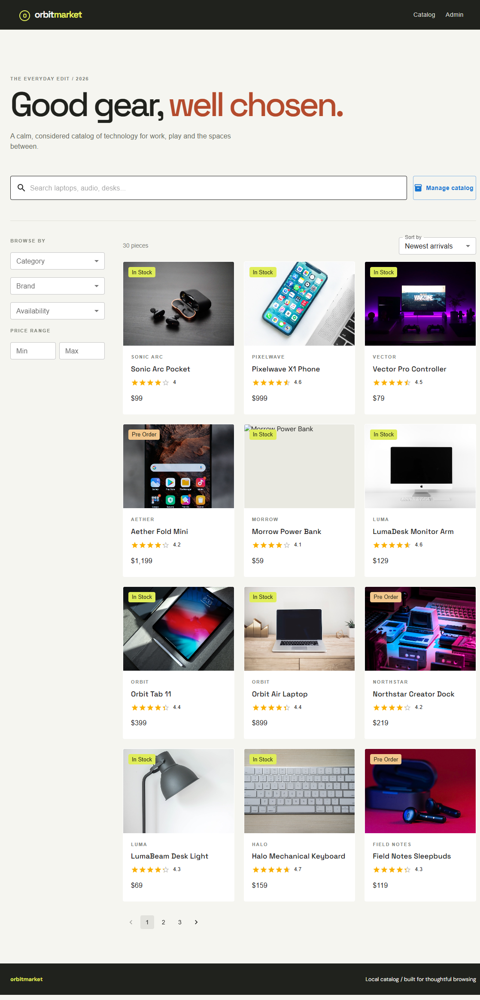
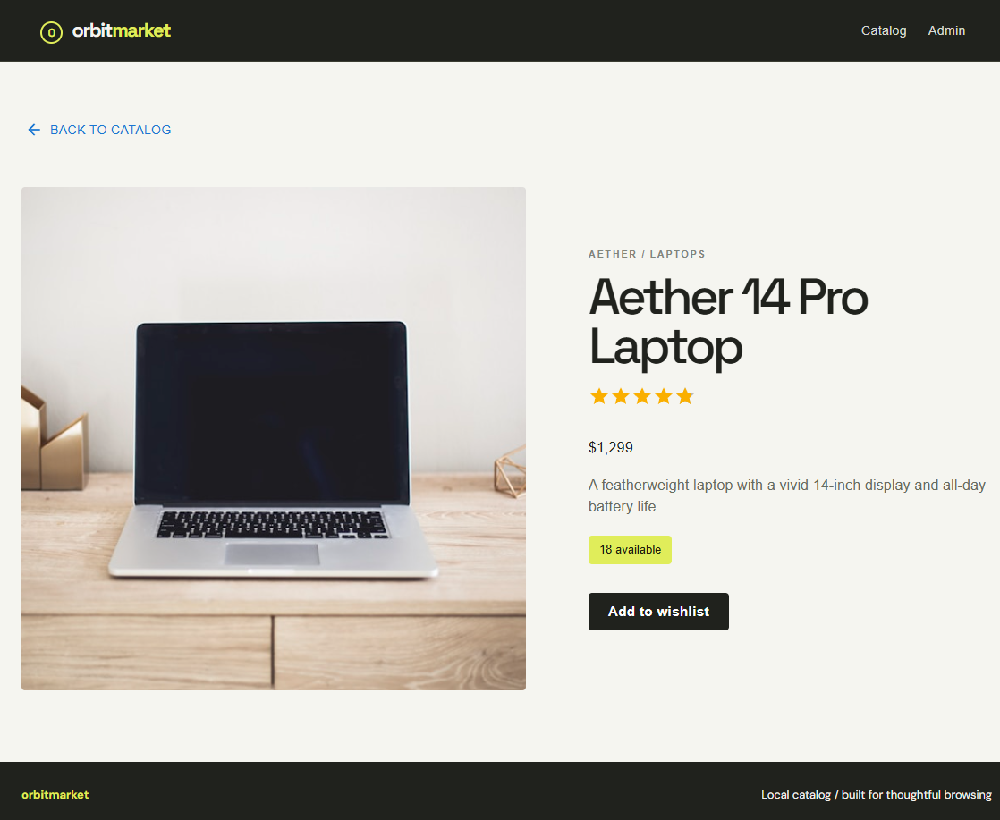
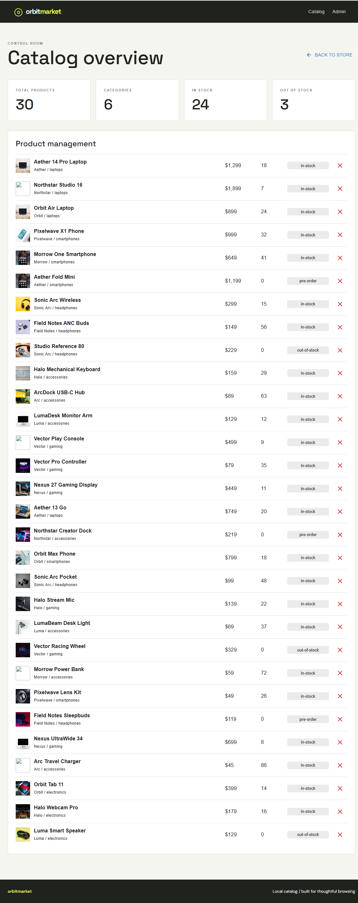
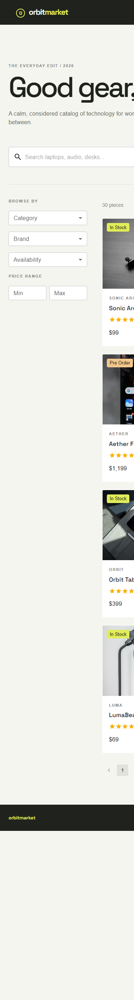

# Online E-Commerce Product Catalog

A portfolio-ready local product catalog built around a scalable REST architecture. Browse, search, filter, sort and paginate a realistic technology catalog, then inspect the admin dashboard for inventory stats and product removal.

## Features

- Backend pagination, search, filtering and allow-listed sorting
- 30 seeded products, 6 categories and 10 brands
- Product detail pages and responsive product grid
- Debounced search requests and mobile filter drawer
- Admin dashboard with inventory stats and delete action
- Validation, sanitization, centralized error responses
- Repository/data-access layer over local JSON files
- In-memory category, brand, availability and category indexes at server startup

## Technology

React, Vite, Material UI, React Router, Axios, Node.js and Express. JavaScript only.

## Run locally

Requirements: Node.js 20+.

```bash
npm install
npm run install:all
npm run dev
```

The client runs at `http://localhost:5173` and the API at `http://localhost:4000`. No cloud service, database, account or environment variable is required.

To run separately:

```bash
npm install --prefix server
npm install --prefix client
npm --prefix server run dev
npm --prefix client run dev
```

## API

Products:

- `GET /api/products?page=1&limit=12&category=laptops&minPrice=500&maxPrice=2000&availability=in-stock&brand=Aether&sort=price_asc`
- `GET /api/products/search?q=laptop&page=1&limit=12`
- `GET /api/products/:id`
- `POST`, `PUT`, `DELETE /api/products` and `/api/products/:id`
- `GET /api/products/meta/brands`
- `GET /api/products/meta/stats`

Categories:

- `GET /api/categories`
- `GET /api/categories/:id`
- `POST`, `PUT`, `DELETE /api/categories` and `/api/categories/:id`

Responses use `{ success, data }` for success and `{ success: false, message }` for errors. Category deletion is rejected while products still reference the category.

## Architecture

```text
client React UI -> Axios -> Express routes -> controllers -> services -> repositories -> JSON files
```

Controllers do not access the datastore directly. `JsonRepository` provides the replaceable persistence boundary. Local indexes are honest in-memory Maps used by the repository during development; they are rebuilt when the server starts.

Local JSON storage is used for development. The repository layer is designed to be replaced with MongoDB/Mongoose, where indexes would be created on frequently queried fields such as category, brand, availability and price.

## Validation and performance

Product names and descriptions are length-limited and sanitized. Prices, stock, ratings, availability and category references are validated before reaching the repository. Search is sanitized and limited, and only predefined sort values are accepted. Filtering happens before backend pagination, so the React client never loads the complete catalog to paginate locally.

## Project structure

- `client/src/App.jsx`: catalog, product detail and admin views
- `client/src/api.js`: Axios API boundary
- `server/src/controllers`: HTTP orchestration
- `server/src/services`: validation and domain behavior
- `server/src/repositories`: JSON persistence and indexes
- `server/src/data`: local products and categories

## Screenshots

Screenshots below were captured from the running local application.

### Product Catalog

Browse the full catalog with backend pagination, sorting, category, brand, availability and price controls.

<p align="center">
	
</p>

### Search and Filtering

Search requests are debounced in the client and executed on the server against product names, descriptions, brands and tags.

<p align="center">
	
</p>

### Product Details

Each product has a dedicated route with imagery, rating, price, availability and stock information.

<p align="center">
	
</p>

### Admin Dashboard

The admin view summarizes inventory and provides a product management table backed by the same REST API.

<p align="center">
	
</p>

### Mobile Responsive UI

The catalog layout collapses for smaller screens and moves filters into a bottom drawer.

<p align="center">
	
</p>

## Demo flow

1. Open the catalog
2. Search for `laptop`
3. Filter by category and availability
4. Apply a price range
5. Sort by price or rating
6. Navigate through pages
7. Open product details
8. Open the admin dashboard
9. Remove a product and refresh the inventory stats

## Future MongoDB migration

A MongoDB/Mongoose implementation can replace the repository modules without changing controllers, services or frontend API contracts. MongoDB indexes should cover category, brand, availability and price for the most common query combinations.
