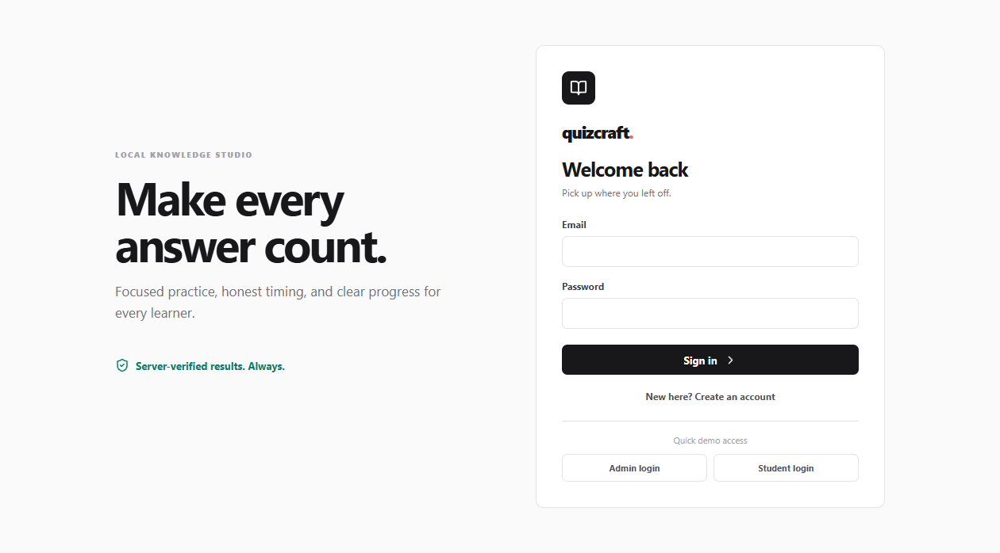
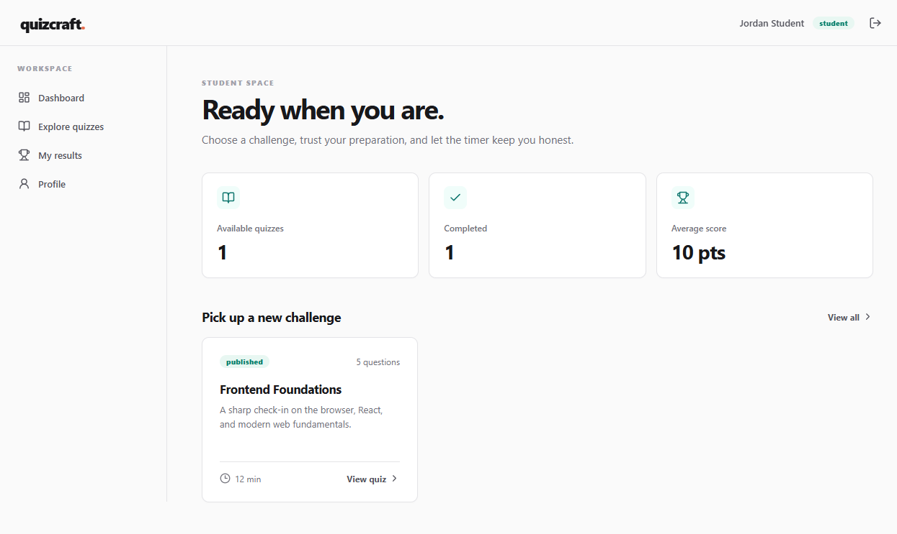
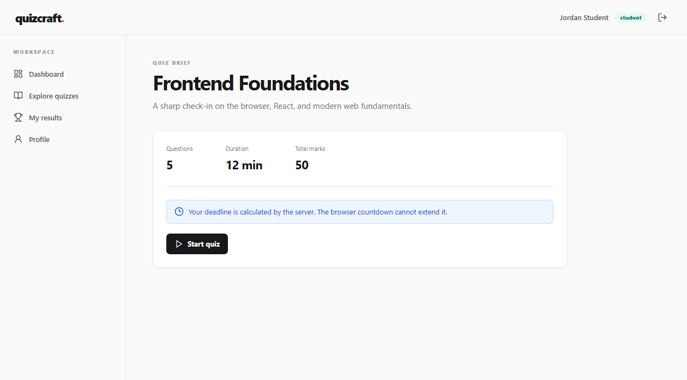
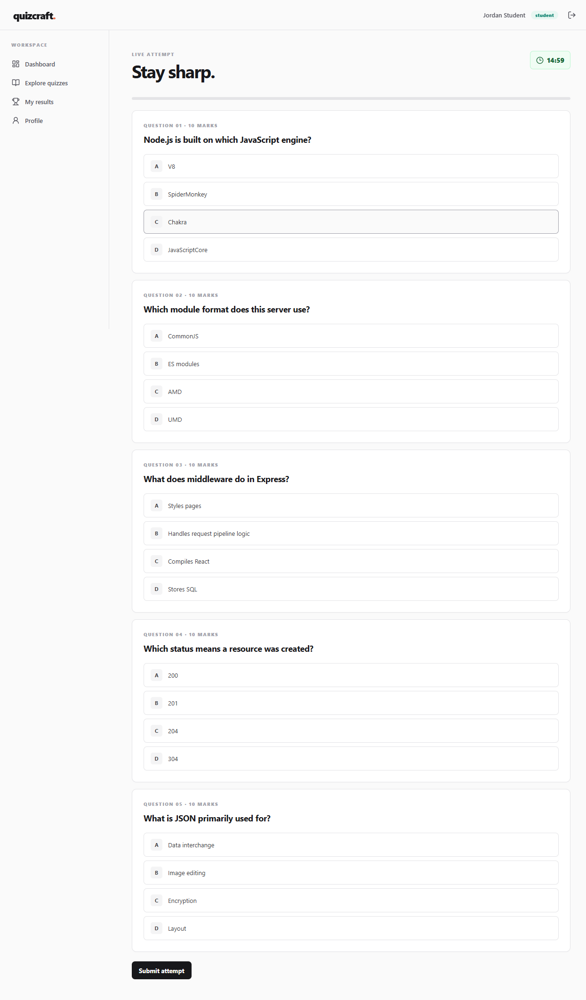
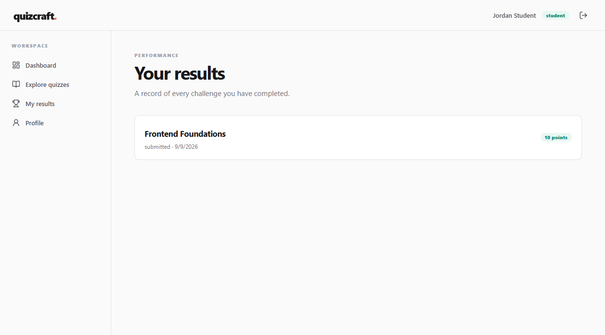
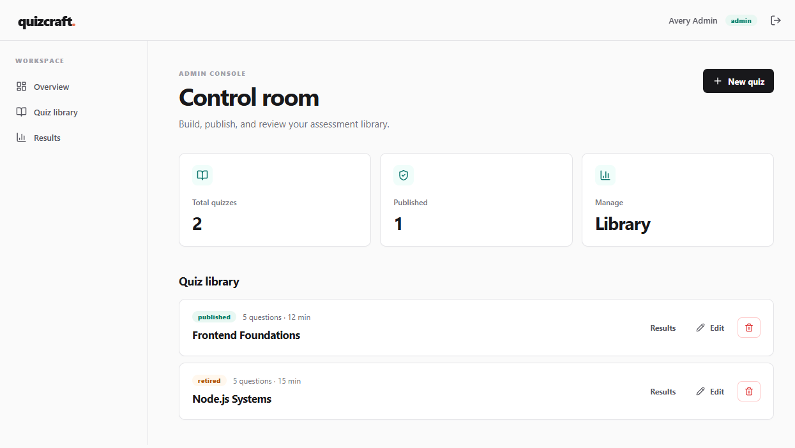
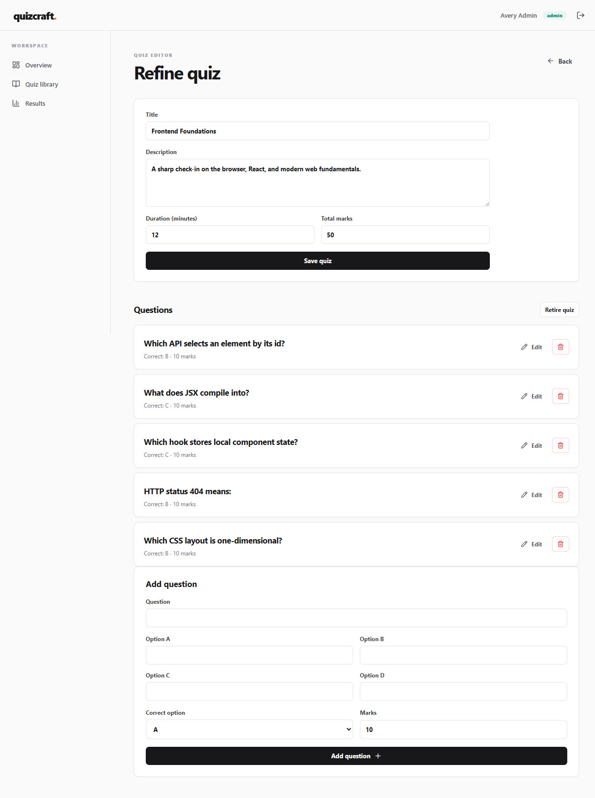

# QuizCraft Project Guide

QuizCraft is a complete local online quiz system for students and administrators. It is designed to run offline after dependencies are installed and does not require MySQL, PostgreSQL, MongoDB, MongoDB Atlas, or any cloud database.

## Demo

These screenshots are real captures from the running application. Because the image paths are relative to this Markdown file, GitHub renders them inline when the `screenshots/` folder is committed with the project.

### Login



### Student Dashboard



### Quiz Brief



### Live Quiz Timer



### Student Results



### Admin Dashboard



### Quiz Editor



## What It Includes

- Student registration and login
- Admin login and protected admin workspace
- Quiz creation, editing, publishing, retiring, and deletion
- Question creation, editing, and deletion
- Quiz duration and marks configuration
- Server-authoritative quiz timer
- Secure answer handling
- Server-side scoring
- Duplicate-attempt prevention
- Student dashboards and results
- Admin attempt and results views
- Local JSON persistence
- Responsive shadcn-style UI with Lucide icons

## Technology Stack

### Frontend

- React
- Vite
- React Router
- Axios
- Local shadcn-style CSS primitives
- Lucide React icons

### Backend

- Node.js
- Express.js
- JWT authentication
- bcrypt password hashing
- UUID identifiers
- CORS
- dotenv

### Persistence

The application uses local JSON files:

```text
server/data/users.json
server/data/quizzes.json
server/data/questions.json
server/data/attempts.json
```

No external database is used.

## Architecture

```text
React UI
   |
   | Axios HTTP requests
   v
Express REST API
   |
   | Authentication and role middleware
   v
Route handlers and services
   |
   | Repository abstraction
   v
JSON repository layer
   |
   v
Local JSON files
```

The repository layer is implemented in:

```text
server/src/storage.js
```

The rest of the API uses repository functions instead of directly reading or changing JSON files. A real database adapter can be added later without rewriting the frontend API contract.

## Project Structure

```text
proj 1/
├── client/
│   ├── src/
│   │   ├── App.jsx       # Routes, screens, authentication, quiz flows
│   │   ├── App.css       # Local shadcn-style visual system
│   │   ├── api.js        # Axios client and JWT header injection
│   │   └── main.jsx      # React entry point
│   └── package.json
├── server/
│   ├── data/
│   │   ├── users.json
│   │   ├── quizzes.json
│   │   ├── questions.json
│   │   └── attempts.json
│   ├── src/
│   │   ├── index.js      # Express API and routes
│   │   ├── seed.js       # Demo data seeding
│   │   └── storage.js    # JSON repository layer
│   └── package.json
├── screenshots/
├── README.md
├── PROJECT_GUIDE.md
└── package.json
```

## Running The Project

[svg](https://github.com/diyaRawat0/CodecRepo/blob/main/Online-Quiz-System/README.md#running-the-project)

Clone the repository:

```bash
git clone https://github.com/diyaRawat0/CodecRepo.git
cd CodecRepo/Online-Quiz-System
npm install
npm run install:all
npm run dev
```

Open the frontend:
```text
http://localhost:5173
```

The API runs at:

```text
http://localhost:5000
```

To run the services separately:

```powershell
npm run start --prefix server
npm run dev --prefix client
```

## Demo Accounts

### Admin

```text
Email: admin@quizcraft.local
Password: Admin123!
```

### Student

```text
Email: student@quizcraft.local
Password: Student123!
```

### Second Student

```text
Email: taylor@quizcraft.local
Password: Student123!
```

The login screen also provides visible **Admin login** and **Student login** demo buttons.

## Admin Workflow

1. Sign in using the admin account.
2. Open the admin dashboard at `/admin`.
3. Click **New quiz**.
4. Enter the quiz title, description, duration, and marks.
5. Save the quiz.
6. Add questions with four options and a correct option.
7. Edit or delete questions as needed.
8. Click **Publish quiz**.
9. Students can now see the quiz.
10. Open **Results** to inspect attempts.
11. Click **Retire quiz** to remove it from the student catalog.

Admin routes:

```text
/admin
/admin/quizzes
/admin/quizzes/new
/admin/quizzes/:id/edit
/admin/quizzes/:id/results
```

## Student Workflow

1. Sign in using the student account.
2. The dashboard displays published quizzes.
3. Open a quiz brief.
4. Click **Start quiz**.
5. Answer the questions.
6. Watch the countdown.
7. Submit the attempt.
8. View the score under **My results**.

Student routes:

```text
/dashboard
/quizzes
/quiz/:id
/quiz/:id/attempt
/results
/profile
```

## Authentication

The authentication flow is:

1. The user submits email and password.
2. The server looks up the user in `users.json`.
3. bcrypt compares the submitted password with the stored hash.
4. The server issues a JWT containing the user id, role, name, and email.
5. The frontend stores the token in local storage.
6. Axios attaches the token to future API requests.
7. Express middleware validates the token.
8. Admin middleware checks `role === "admin"`.

Password hashes are never returned by the API.

## Server-Side Timer

When a student starts a quiz, the server creates an attempt like this:

```json
{
  "id": "attempt-id",
  "userId": "student-id",
  "quizId": "quiz-id",
  "startedAt": "server-generated-time",
  "expiresAt": "server-generated-time-plus-duration",
  "status": "active",
  "answers": [],
  "score": null
}
```

The frontend countdown is for display only. During submission, the backend compares its own current time against `expiresAt`.

If the attempt is expired:

- Normal submission is rejected
- The attempt is marked `expired`
- The frontend cannot extend the deadline by changing browser state

## Secure Answers And Scoring

Student quiz responses contain:

```json
{
  "questionId": "question-id",
  "questionText": "question text",
  "options": {
    "A": "first option",
    "B": "second option",
    "C": "third option",
    "D": "fourth option"
  },
  "marks": 10
}
```

The `correctOption` field is removed from student responses.

On submission, the backend:

1. Loads the attempt.
2. Confirms the attempt belongs to the logged-in student.
3. Confirms the attempt is still active.
4. Checks the server time against `expiresAt`.
5. Validates question ids and options.
6. Loads the real questions from `questions.json`.
7. Calculates the authoritative score.
8. Stores the submitted answers and score in `attempts.json`.

## Duplicate Attempts

A student can attempt a quiz only once.

- If an active attempt exists, the API returns that attempt.
- If a submitted attempt exists, a new attempt is rejected.
- If an expired attempt exists, a new attempt is rejected.

## API Overview

### Authentication

```text
POST /api/auth/register
POST /api/auth/login
GET  /api/auth/me
```

### Quizzes

```text
GET    /api/quizzes
GET    /api/quizzes/:id
POST   /api/quizzes
PATCH  /api/quizzes/:id
DELETE /api/quizzes/:id
```

### Questions

```text
POST   /api/quizzes/:id/questions
PATCH  /api/questions/:id
DELETE /api/questions/:id
```

### Attempts

```text
GET  /api/attempts
POST /api/attempts/:quizId/start
POST /api/attempts/:id/submit
```

## Local Data Persistence

The storage layer reads and writes the JSON files relative to the server source directory. Writes use a temporary file and rename operation:

```text
read JSON
write temporary JSON file
rename temporary file over the target
```

This avoids leaving a partially written JSON file during normal sequential local operations.

## Resetting Demo Data

Stop the server, then replace these files with an empty JSON array:

```json
[]
```

Files to reset:

```text
server/data/users.json
server/data/quizzes.json
server/data/questions.json
server/data/attempts.json
```

Start the server again. The seed script recreates the demo users, quizzes, questions, and empty attempts.

## GitHub Screenshot Publishing

To make screenshots appear directly on GitHub:

1. Keep the image files in the repository under `screenshots/`.
2. Keep image references relative to this file, for example:

```markdown

```

3. Commit both `PROJECT_GUIDE.md` and the image files.
4. Push them to GitHub on the same branch.

Do not use a local Windows path such as `C:\Users\...` and do not use `file:///...`. Those paths only work on your computer. Relative paths work on GitHub, VS Code, and when the repository is cloned elsewhere.

The screenshots are real PNG files and will render inline in the GitHub Markdown preview.

## Verification Checklist

### Student

- Register a new student
- Log in
- View the published quiz
- Start a quiz
- Confirm the countdown is visible
- Answer questions
- Submit the quiz
- Verify the score
- Try submitting again
- Try starting the same quiz again
- Confirm duplicate attempts are rejected

### Admin

- Log in as admin
- Create a quiz
- Add questions
- Edit a question
- Delete a question
- Publish the quiz
- Confirm students can see it
- Retire the quiz
- Confirm students can no longer start it
- View attempts and results

## Future Improvements

- Refresh tokens
- Audit logs
- Stronger schema validation
- Pagination
- CSV result exports
- Question banks and categories
- A PostgreSQL repository adapter
- Automated browser tests
