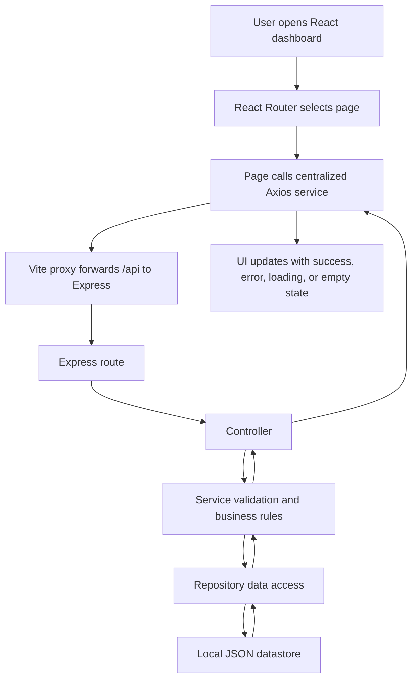
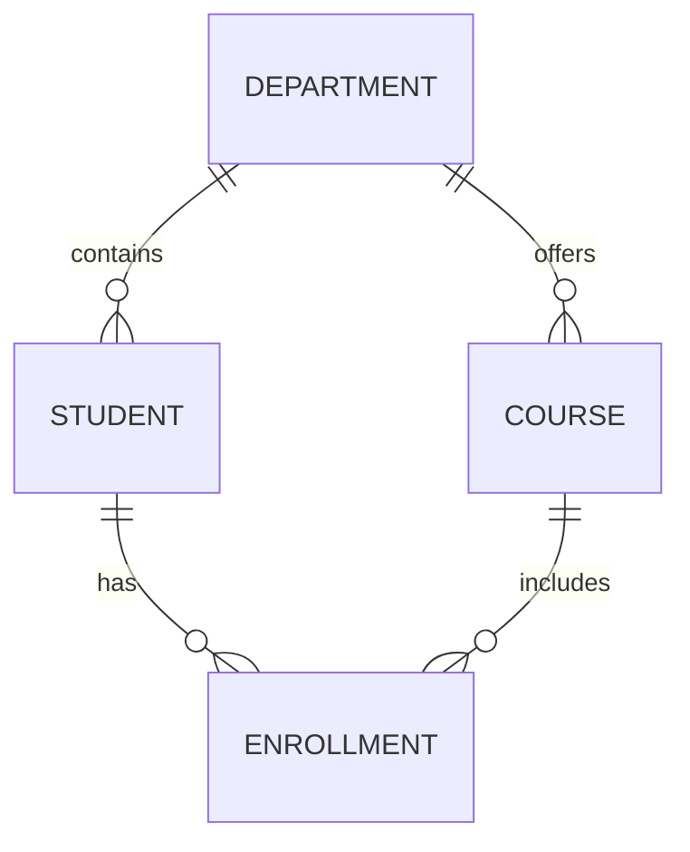
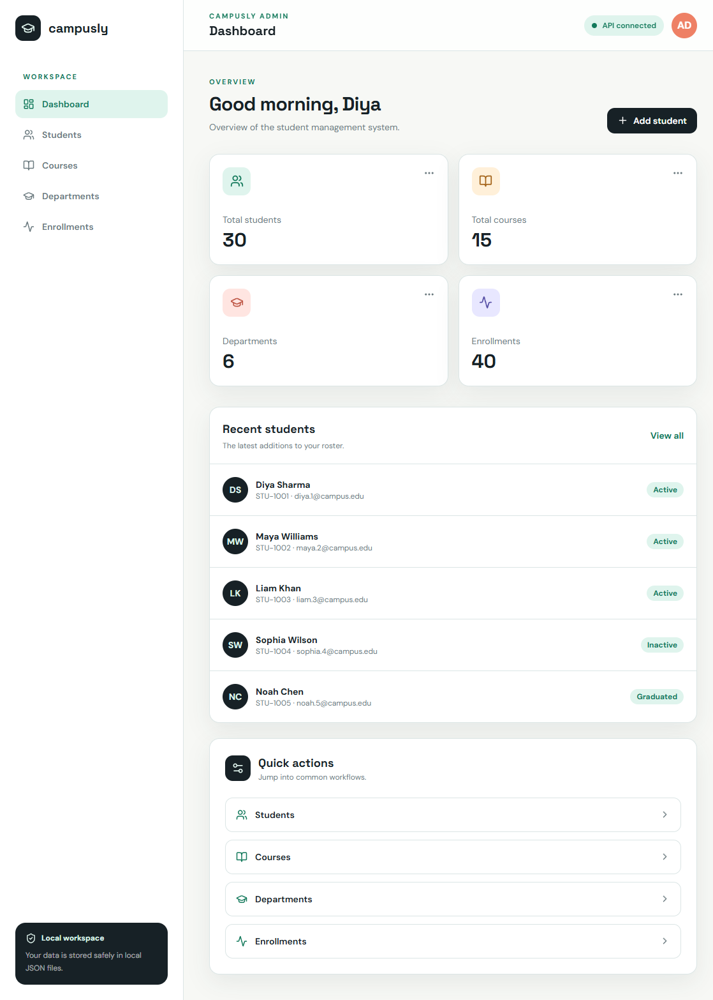
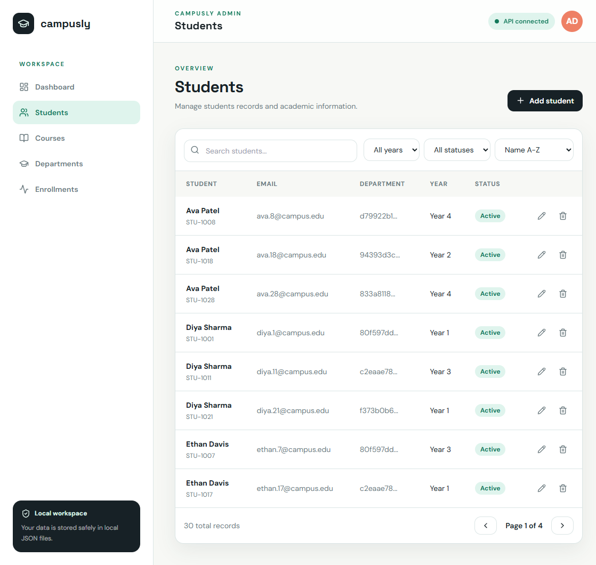
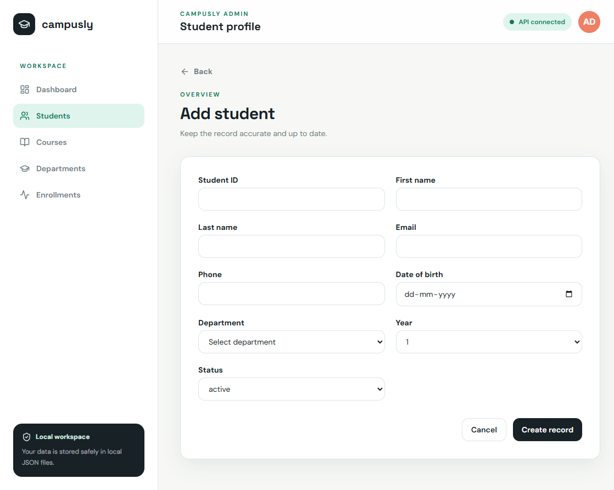
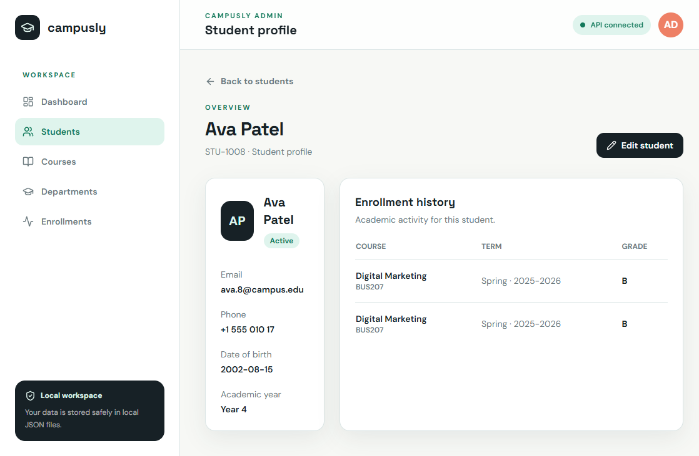
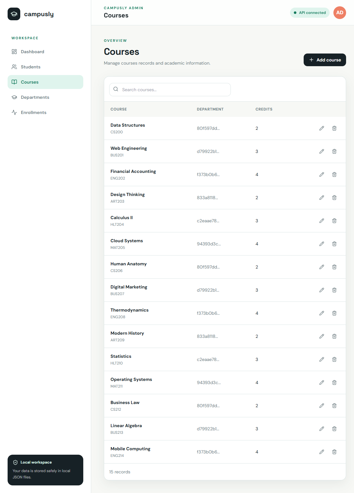
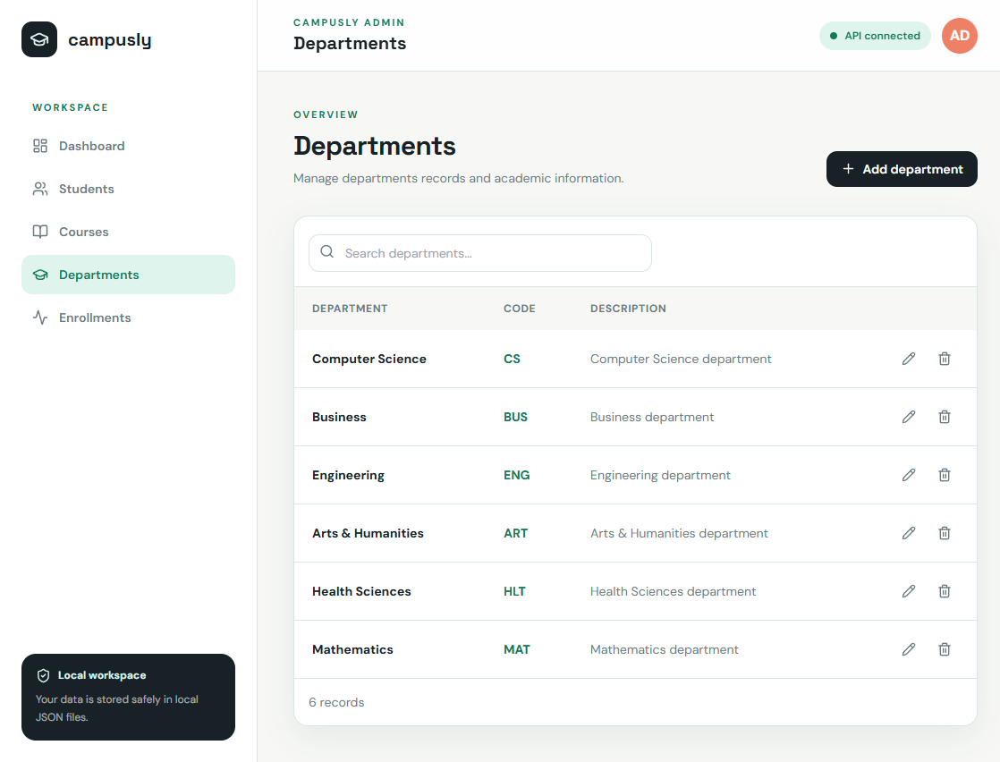
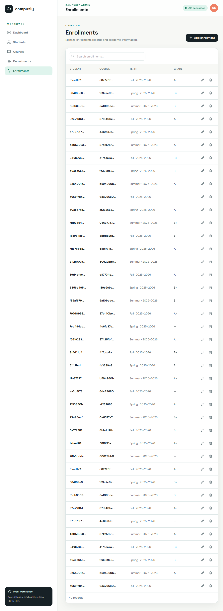

# Campusly Student Management System

Campusly is a portfolio-quality student administration system built as a local full-stack application. It provides a responsive admin dashboard for managing students, departments, courses, and enrollments.
The application runs completely locally. It does not require MySQL, MongoDB, MongoDB Atlas, PostgreSQL, or any cloud service.

## Contents

- [What the project demonstrates](#what-the-project-demonstrates)
- [Complete project flow](#complete-project-flow)
- [Technology stack](#technology-stack)
- [Architecture](#architecture)
- [Data model](#data-model)
- [Installation and startup](#installation-and-startup)
- [Application workflows](#application-workflows)
- [API documentation](#api-documentation)
- [Validation and relational integrity](#validation-and-relational-integrity)
- [Project structure](#project-structure)
- [Demo screenshots](#demo-screenshots)
- [Demo checklist](#demo-checklist)

## What the project demonstrates

- Student, department, course, and enrollment CRUD
- Layered Express backend architecture
- Repository/data-access abstraction over local JSON files
- Backend search, filtering, sorting, and pagination
- Frontend and backend validation
- Duplicate detection and foreign-key-like relationship protection
- Responsive React admin dashboard
- Loading, empty, error, and destructive-action states
- A data layer that can later be replaced with a MySQL implementation

## Complete project flow



### Startup flow

1. `npm run dev` starts the Express API on port `5000` and Vite on port `5173`.
2. Express calls the datastore initializer before accepting requests.
3. Missing JSON files are created with empty arrays.
4. Malformed JSON files are safely replaced with valid empty collections.
5. The browser loads the React dashboard at `http://localhost:5173`.
6. Dashboard cards request students, courses, departments, and enrollments through Axios.
7. The API returns consistent `{ success, data }` or `{ success, message }` responses.

### Read flow

1. A page requests data through `client/src/services/api.js`.
2. The request reaches an Express route under `/api`.
3. The controller forwards the request to a service.
4. The service applies validation, search, filtering, sorting, pagination, or relationship rules.
5. The repository reads the matching JSON file.
6. The response is returned to the page and rendered in the dashboard UI.

### Write flow

1. The user submits a form.
2. React performs required-field and basic browser validation.
3. Axios sends the payload to a `POST` or `PUT` endpoint.
4. The service trims strings, normalizes emails/codes, validates values, and checks related IDs.
5. The repository writes the updated collection to the appropriate JSON file.
6. The page navigates back to the resource list and displays the updated data.

## Technology stack

### Frontend

- React
- Vite
- React Router
- Tailwind CSS
- Lucide React icons
- Axios

### Backend

- Node.js
- Express.js
- Helmet
- CORS
- Morgan request logging

### Storage

- Local JSON files in `server/src/data/`
- No external database or cloud service

## Architecture

```text
React pages and components
	|
	v
Centralized Axios services
	|
	v
Express REST routes
	|
	v
Controllers
	|
	v
Business services and validation
	|
	v
Repository/data-access layer
	|
	v
Local JSON files
```

Controllers do not read or write JSON files. Services own business rules. Repositories own persistence. A future SQL repository can replace the JSON repository without changing controllers, services, or the frontend.

## Data model

### Student

`id`, `studentId`, `firstName`, `lastName`, `email`, `phone`, `dateOfBirth`, `departmentId`, `year`, `status`, `createdAt`, `updatedAt`

### Department

`id`, `name`, `code`, `description`

### Course

`id`, `courseCode`, `name`, `description`, `credits`, `departmentId`

### Enrollment

`id`, `studentId`, `courseId`, `semester`, `academicYear`, `grade`, `enrolledAt`

### Relationships



## Installation and startup

Requirements: Node.js 18 or newer and npm.

```bash
npm install
npm run install:all
npm run seed
npm run dev
```

Open the application at:

- Frontend: `http://localhost:5173`
- Backend: `http://localhost:5000`
- Health check: `http://localhost:5000/api/health`

The seed command resets and populates the datastore with:

- 6 departments
- 30 students
- 15 courses
- 40 enrollments

## Application workflows

### Dashboard workflow

1. Open the dashboard.
2. Review total students, courses, departments, and enrollments.
3. Review recently created students.
4. Use quick-action links to open each management workspace.

### Student workflow

1. Open **Students** from the sidebar.
2. Search by student ID, first name, last name, or email.
3. Filter by year and status.
4. Sort by name, student ID, year, or newest record.
5. Move between backend-powered pages.
6. Select **Add student** to create a record.
7. Open a student name to view profile information and enrollment history.
8. Select edit to update the record.
9. Select delete and confirm the action.

Search requests are debounced in the UI and authoritative filtering happens on the backend.

### Department workflow

1. Open **Departments**.
2. Create a department with a unique code.
3. Edit its name, code, or description.
4. Attempt to delete a department that has students or courses.
5. The API blocks the deletion and explains which relationship prevents it.

### Course workflow

1. Open **Courses**.
2. Create a course with a unique course code.
3. Select an existing department.
4. Set a positive integer credit value.
5. Edit or delete the course when it has no enrollments.

### Enrollment workflow

1. Open **Enrollments**.
2. Select an existing student and course.
3. Choose a semester and academic year.
4. Optionally add a grade.
5. Submit the enrollment.
6. Try the same student, course, semester, and academic-year combination again.
7. The API rejects the duplicate enrollment.

## API documentation

All responses use one of these formats:

```json
{ "success": true, "data": {} }
```

```json
{ "success": false, "message": "A useful error message" }
```

### Students

| Method   | Endpoint            | Description                      |
| -------- | ------------------- | -------------------------------- |
| `GET`    | `/api/students`     | List students with query support |
| `POST`   | `/api/students`     | Create a student                 |
| `GET`    | `/api/students/:id` | Read one student                 |
| `PUT`    | `/api/students/:id` | Update a student                 |
| `DELETE` | `/api/students/:id` | Delete an unreferenced student   |

Supported list query parameters:

`search`, `department`, `year`, `status`, `sort`, `page`, `limit`

Example:

```text
GET /api/students?search=diya&year=3&status=active&sort=newest&page=1&limit=10
```

Example response:

```json
{
  "success": true,
  "data": {
    "students": [],
    "pagination": {
      "page": 1,
      "limit": 10,
      "totalStudents": 3,
      "totalPages": 1,
      "hasNextPage": false,
      "hasPreviousPage": false
    }
  }
}
```

### Departments, courses, and enrollments

Each resource supports the same CRUD pattern:

```text
GET    /api/departments
POST   /api/departments
GET    /api/departments/:id
PUT    /api/departments/:id
DELETE /api/departments/:id

GET    /api/courses
POST   /api/courses
GET    /api/courses/:id
PUT    /api/courses/:id
DELETE /api/courses/:id

GET    /api/enrollments
POST   /api/enrollments
GET    /api/enrollments/:id
PUT    /api/enrollments/:id
DELETE /api/enrollments/:id
```

## Validation and relational integrity

Backend validation is always applied even when the request comes from the trusted local frontend.

- Student IDs and emails are unique.
- Emails are trimmed and normalized to lowercase.
- Student years must be integers from 1 through 4.
- Student statuses are `active`, `inactive`, or `graduated`.
- Department and course codes are unique.
- Courses require a positive integer credit value.
- Student and course department IDs must exist.
- Enrollment student and course IDs must exist.
- Duplicate student/course/semester/academic-year enrollments are rejected.
- Students and courses cannot be deleted while enrollments reference them.
- Departments cannot be deleted while students or courses reference them.

The current version uses local JSON persistence. Relational constraints are therefore enforced at the application layer. The repository abstraction allows the data layer to later be replaced with MySQL, where foreign-key constraints can enforce these relationships. The current JSON implementation does not claim SQL injection protection.

## Project structure

```text
.
├── client/
│   ├── src/
│   │   ├── services/api.js
│   │   ├── index.css
│   │   └── main.jsx
│   ├── package.json
│   ├── tailwind.config.js
│   └── vite.config.js
├── server/
│   ├── src/
│   │   ├── controllers/
│   │   ├── data/
│   │   ├── middleware/
│   │   ├── repositories/
│   │   ├── routes/
│   │   ├── services/
│   │   ├── utils/
│   │   ├── validators/
│   │   ├── app.js
│   │   └── server.js
│   └── package.json
├── screenshots/
├── .gitignore
├── package.json
└── README.md
```

## Demo screenshots

These screenshots were captured from the locally running application after seeding the JSON datastore. They show the main dashboard and each primary management flow.

### Dashboard



### Student management



### Student form



### Student details



### Course management



### Department management



### Enrollment management



## Demo checklist

1. Start the app with `npm run dev`.
2. Open the dashboard.
3. Confirm seeded statistics are visible.
4. Search for `Diya` in Students.
5. Apply year, status, and sort controls.
6. Navigate through pagination.
7. Create, edit, view, and delete a student.
8. Create and edit a department.
9. Attempt to delete a referenced department and verify it is blocked.
10. Create and edit a course.
11. Attempt a course with an invalid department ID through the API and verify rejection.
12. Create an enrollment.
13. Attempt a nonexistent student or course and verify rejection.
14. Attempt a duplicate enrollment and verify rejection.
15. Review the screenshots listed above when presenting the project on GitHub.
